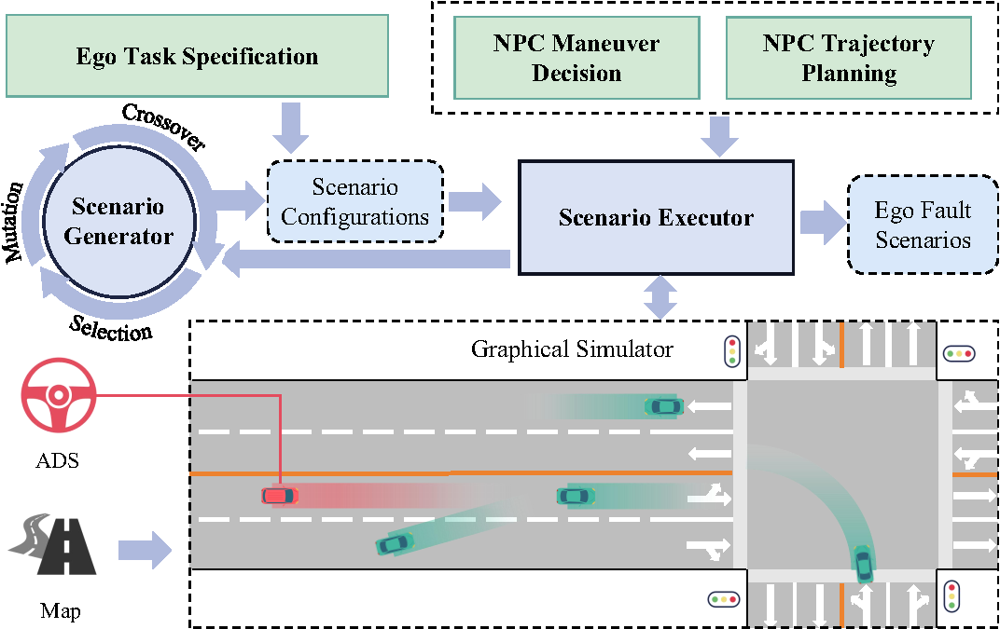

# DynNPC: Finding More Violations Caused by ADS in Simulation Testing through Dynamic NPC Behavior Generation

In this work, we propose a novel scenario-based testing framework, DynNPC, to generate more violation scenarios caused by the ADS. Specifically, DynNPC allows NPC vehicles to dynamically generate behaviors using different driving strategies during simulation execution according to traffic signals and the realtime behavior of the Ego vehicle. We compare DynNPC with four state-of-the-art scenario-based testing approaches. Our evaluation has demonstrated the effectiveness and efficiency of DynNPC in finding more violation scenarios caused by the ADS.



**Note: This is the first version of DynNPC, and we plan to release updates in the future.**

**The paper will be submitted to ICSE 2026.**

## Experiment Environment
We conduct all the experiments on a system with the following specifications:

- Operating System: Ubuntu 22.04.4 LTS
- GPU: NVIDIA GeForce RTX 3090
- CPU: Intel Core i9-13900K (32) @ 5.500GHz
- Memory: 64GB


## Installation & Run

### 1. Install the LGSVL Simulator
LGSVL simulator can be installed from https://github.com/lgsvl/simulator .We are using the latest version, 2021.3.\
LGSVL has made the difficult decision to suspend active development of SVL Simulator, as of January 1, 2022. The cloud had stopped running on June 30, 2022.Therefore, we use SORA-SVL to build our own server as a replacement.SORA-SVL can be installed from https://github.com/YuqiHuai/SORA-SVL
### 2. Install Apollo 8.0
clone source code
```sh
$ git clone https://github.com/ApolloAuto/apollo.git
```
pull docker image and enter the container(This step may take a long time)
```sh
$ sudo bash ./docker/scripts/dev_start.sh
$ sudo bash ./docker/scripts/dev_into.sh
```
build Apollo
```sh
sudo ./apollo.sh build
```
start dreamviewer
```sh
sudo bash scripts/bootstrap.sh
```
After completion, open localhost:8888 and you can see the Dreamviewer Interface.\
bridge Apollo with LGSVL
```sh
bash scripts/bridge.sh
``` 
### 3. DynNPC

DynNPC is a novel simulation testing approach, to generate adversarial scenarios on main lanes (e.g., urban roads and highways). DynNPC allows NPC vehicles to dynamically interact with the EGO vehicle and regulates the behaviors of NPC vehicles, finding more violation scenarios caused by the EGO vehicle more quickly.

To set up DynNPC:

1. Clone the repository:
   ```sh
   git clone https://github.com/DynNPC/DynNPC.git
   ```

2. Navigate to the project directory:
   ```sh
   cd code
   ```

3. Install the required dependencies:
   ```sh
   pip install -r requirements.txt
   ```

4. Configure DynNPC to work with the specific ADS and simulation environment：
      - *Straight Road* : Modify the `src/configs/config.yaml` file to specify the simulation environment and the ADS to be tested.
      - *Intersection* : Modify the `src/configs/config_int.yaml` file to specify the simulation environment and the ADS to be tested.
      - Modify the `src/settings` file to specify the map and scenario to be tested.

5. Run DynNPC:
   ```sh
   python src/main.py
   ```

**Note:** Records of the experiments can be found in the `results` directory.


## Baselines

### 1. AV-FUZZER

AV-Fuzzer is a well-known search-based testing technique, which uses genetic algorithm to evolve NPC vehicles’ movements to expose safety violations of ADSs. It can be found at [https://github.com/cclinus/AV-Fuzzer](https://github.com/cclinus/AV-Fuzzer).

To set up AV-FUZZER:

1. Clone the repository:
   ```sh
   git clone https://github.com/cclinus/AV-Fuzzer.git
   ```

2. Follow the installation instructions provided in the repository's README file.

3. Configure AV-FUZZER to work with the specific ADS and simulation environment.

4. Run AV-FUZZER according to the usage instructions in the repository.

Note: Make sure your system meets the requirements specified in the AV-FUZZER repository before installation.


### 2. ADFuzz

AutoFuzz is a novel fuzzing testing technique
guided by a neural network evolutionary search method. It can be found at [https://github.com/AIasd/ADFuzz](https://github.com/AIasd/ADFuzz).

To set up ADFuzz:

1. Clone the repository:
   ```sh
   git clone https://github.com/AIasd/ADFuzz.git
   ```

2. Follow the installation instructions provided in the repository's README file.

3. Configure ADFuzz to work with the specific ADS and simulation environment.

4. Run ADFuzz according to the usage instructions in the repository.

Note: Ensure that your system meets the requirements specified in the ADFuzz repository before installation.


### Setup
Install SVL2021.3 and Apollo Master (tested upto Apollo 7.0) following [the documentation of Running latest Apollo with SVL Simulator](https://www.svlsimulator.com/docs/system-under-test/apollo-master-instructions/).


#### Install SVL Python API
```
git clone https://github.com/lgsvl/PythonAPI.git
```
Following the installation procedure at [https://github.com/lgsvl/PythonAPI](https://github.com/lgsvl/PythonAPI)

#### Add channel_extraction
```
git clone https://github.com/AIasd/apollo_channel_extraction.git
```
and put the folder  `channel_extraction` inside `apollo/cyber/python/cyber_py3/`. Note that this step is preferred to be done before building apollo `./apollo.sh build_opt_gpu` to avoid an extra building step.


#### Create an Configuration supporting Apollo 6.0 (or later) with the perception module in Vehicles Library
SVL does not have a default "Apollo 6.0 (or later)" for "Lincoln2017MKZ" under "Vehicles". To create one, on SVL web UI,

1. Under 'Vehicles Library > Lincoln2017MKZ > Sensor Configurations', clone "Apollo 5.0", rename it to "Apollo 6.0 (with Signal Sensor)".

2. Add the sensors "Clock Sensor", "Signal Sensor", and "3D Ground Truth" into "Apollo 6.0 (with Signal Sensor)" following those defined in "Apollo 6.0 (modular testing)".

3. Change the "Topic" and "X" of "3D Ground Truth" to "/apollo/perception/obstacles_gt" and "10" respectively.

Note the camera module for traffic light detection of Apollo 6.0 (and later) seems to still not work properly so ground-truth traffic signal is provided via "Signal Sensor".

#### Other preparation
One needs to change the used value of the variable `model_id` in `simulation_utils.py` and `svl_specific.py` to one's own model_id on SVL web UI. For example, if one set `ego_car_model` to `'apollo_6_with_signal'` when running fuzzing, one can replace `'9272dd1a-793a-45b2-bff4-3a160b506d75'` in `simulation_utils.py` and `svl_specific.py` with one's own vehicle configuration id (this can be found by clicking the id symbol of one's chosen 'Configuration Name' (e.g., "Apollo 6.0 (with Signal Sensor)") under the 'Actions' column of the 'Sensor Configurations' table under 'Vehicles Library > Lincoln2017MKZ > Sensor Configurations' on SVL web UI).

### Run Fuzzing
Start Apollo and SVL API only respectively following [the documentation of Running latest Apollo with SVL Simulator](https://www.svlsimulator.com/docs/system-under-test/apollo-master-instructions/).


Then in a second terminal:
Find apollo docker container id via:
```
docker ps
```
then entering the docker via:
```
docker exec -it <container name> /bin/bash
```
install zmq via pip in the docker:
```
pip install zmq
```
and finally run the channel_extraction
```
./bazel-bin/cyber/python/cyber_py3/channels_data_extraction/channels_extraction
```


Finally, in a third terminal:
If running GA-UN and using apollo with only ground-truth traffic signal:
```
python ga_fuzzing.py --simulator svl --n_gen 2 --pop_size 2 --algorithm_name nsga2-un --has_run_num 4 --objective_weights -1 1 1 0 0 0 0 0 0 0 --check_unique_coeff 0 0.1 0.5 --episode_max_time 35 --ego_car_model apollo_6_with_signal --route_type 'BorregasAve_left' --scenario_type 'turn_left_one_ped_and_one_vehicle' --record_every_n_step 5 --n_offsprings 50
```
Or if running GA-UN and using apollo with all ground-truth perception:
```
python ga_fuzzing.py --simulator svl --n_gen 2 --pop_size 2 --algorithm_name nsga2-un --has_run_num 4 --objective_weights -1 1 1 0 0 0 0 0 0 0 --check_unique_coeff 0 0.1 0.5 --episode_max_time 35 --ego_car_model apollo_6_modular_2gt --route_type 'BorregasAve_left' --scenario_type 'turn_left_one_ped_and_one_vehicle' --record_every_n_step 5 --n_offsprings 100
```

Or if running AVFuzzer
```
python ga_fuzzing.py --simulator svl --n_gen 50 --pop_size 4 --algorithm_name avfuzzer --has_run_num 100 --objective_weights -1 1 1 0 0 0 0 0 0 0 --check_unique_coeff 0 0.1 0.5 --episode_max_time 35 --ego_car_model apollo_6_with_signal --only_run_unique_cases 0 --route_type 'BorregasAve_left' --scenario_type 'turn_left_one_ped_and_one_vehicle' --record_every_n_step 5
```

### Rerun
```
python svl_script/rerun_svl.py
```

### 3. CRISCO
CRISCO is "A Road Structure-based Approach to Test Planning Module of Autonomous Driving System". It can be found at [https://github.com/criscotesting/CRISCO](https://github.com/criscotesting/CRISCO).  
(Now the latest version is available at [https://gitlab.com/tianhaoxiang20/racer](https://gitlab.com/tianhaoxiang20/racer))

To set up CRISCO:

1. Clone the repository:
   ```sh
   git clone https://gitlab.com/tianhaoxiang20/racer.git
   ```

2. Follow the installation instructions provided in the repository's README file.

3. Configure CRISCO to work with the specific ADS and simulation environment.

4. Run CRISCO according to the usage instructions in the repository.

Note: Make sure your system meets the requirements specified in the CRISCO repository before installation.

### 4. BehAVExplor
BehAVExplor is a novel behavior-guided fuzzing technique to explore the different behaviors of the ego vehicle (i.e., the vehicle controlled by the ADS under test) and detect diverse violations. It can be found at [https://github.com/MingfeiCheng/BehAVExplor](https://github.com/MingfeiCheng/BehAVExplor).  


To set up BehAVExplor:

1. Clone the repository:
   ```sh
   git clone https://github.com/MingfeiCheng/BehAVExplor
   ```

2. Follow the installation instructions provided in the repository's README file.

3. Configure BehAVExplor to work with the specific ADS and simulation environment.

4. Run BehAVExplor according to the usage instructions in the repository.

Note: Make sure your system meets the requirements specified in the BehAVExplor repository before installation.

### 5. DoppelTest
DoppelTest is a Python framework implemented to evaluate a novel autonomous driving software (ADS) testing approach. It can be found at [https://github.com/Software-Aurora-Lab/DoppelTest](https://github.com/Software-Aurora-Lab/DoppelTest).

### INSTALLING DoppelTest

1. Install the required Python libraries via `pip install -r requirements.txt`

> If you run into issues when installing Shapely library, please first run `sudo apt-get install libgeos-dev` to install its dependencies.

2. Replace location of directories in `config.py`

   ```python
   APOLLO_ROOT  = '/xxx/xxx/apollo'
   DT_ROOT      = '/xxx/xxx/DoppelTest'
   ```

3. Verify the framework is runnable via `python test_main.py`

> You should start seeing 3 Apollo instances being started and the scenario is visualizable via a browser. DoppelTest will provide the URL to visualize each instance in the terminal.

4. Start the framework via `python main_ga.py`

> After running DoppelTest for extended period of time, you should see record file of scenarios generated under `data/records`. This is also the step to replicate the results presented in the paper.
