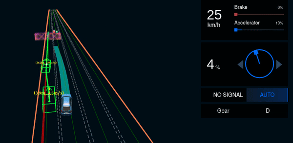
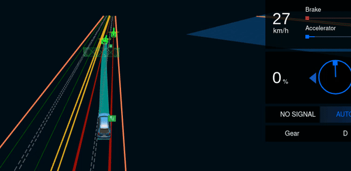
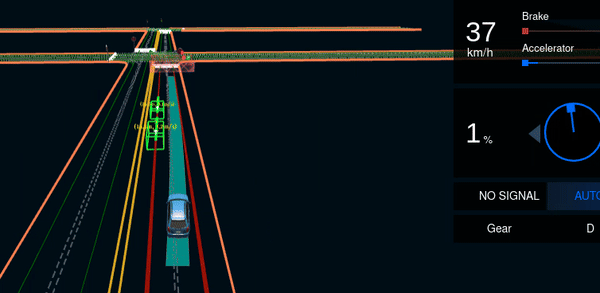
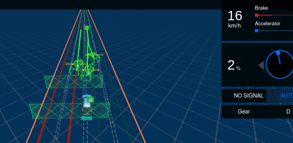

In this work, we propose the concept of adversarial NPC vehicles and introduce AdvFuzz, a novel simulation testing approach, to generate adversarial scenarios on main lanes (e.g., urban roads and highways). AdvFuzz allows NPC vehicles to dynamically interact with the EGO vehicle and regulates the behaviors of NPC vehicles, finding more violation scenarios caused by the EGO vehicle more quickly. We compare AdvFuzz with a random approach and three state-of-the-art scenario-based testing approaches. Our experiments demonstrate that AdvFuzz can generate 198.34% more violation scenarios compared to the other four approaches in 12 hours and increase the proportion of violations caused by the EGO vehicle to 87.04%, which is more than 7 times that of other approaches. Additionally, AdvFuzz is at least 92.21% faster in finding one violation caused by the EGO vehicle than that of the other approaches.

The paper has been submitted to FSE 2025.

## For more details, see the code at [DynNPC GitHub Repository](https://github.com/DynNPC/DynNPC).

## Overview

## Waypoints Generation and Speed Planning

**LEFT_CHANGE maneuver**

<table>
  <tr>
    <td></td>
    <td></td>
  </tr>
</table>

**Description:** When the EGO vehicle is positioned to the left-rear of the NPC vehicle, the adversarial NPC vehicle initially proceeds straight before transitioning into the lane change. The trajectory waypoints are generated using Bézier curves to ensure a smooth path transition. Speed planning is then strategically crafted based on the EGO vehicle’s current speed and projected interactions, as depicted in the s-t graph, to anticipate and plan for potential collision points.

**Right_CHANGE maneuver** is similar to the LEFT_CHANGE maneuver, with the NPC vehicle transitioning from the right lane to the left lane.

**ACCELERATION_STRAIGHT maneuver**

<table>
  <tr>
    <td></td>
    <td></td>
  </tr>
</table>

**Description:** When the EGO vehicle is positioned in the front-left, the adversarial NPC vehicle accelerates to overtake the EGO vehicle. As depicted in the right graph, at the moment t0, the NPC vehicle successfully overtakes the EGO vehicle.

**DECELERATION_STRAIGHT maneuver**

<table>
  <tr>
    <td></td>
    <td></td>
  </tr>
</table>

**Description:** When the EGO vehicle is behind the NPC vehicle, the adversarial NPC vehicle decelerates to simulate a rear-end collision scenario. The right graph shows the speed planning strategy for the NPC vehicle to ensure a collision with the EGO vehicle.

**KEEP_SPEED maneuver**

<table>
  <tr>
    <td></td>
    <td></td>
  </tr>
</table>

**Description:** When the EGO vehicle is in front of the NPC vehicle, the adversarial NPC vehicle maintains a constant speed to avoid a collision. 

## Examples of Generated Scenarios
Here are some dynamically generated scenarios using AdvFuzz, showcasing how the EGO vehicle interacts with adversarial NPC vehicles:

|  |  |
|:------------------------:|:------------------------:|
| Type 1: EGO rear-ends NPC changing lanes | Type 2: EGO hits the side of an NPC |
|  |  |
| Type 3: EGO collides with an NPC | Type 4: EGO hits the rear of an NPC |
|  |  |
| Type 5: EGO hits other NPCs stuck on lane | Type 6: EGO changes across yellow line |
|  |  |
| Type 7: EGO hits the yellow line | Type 8: EGO fails to plan trajectory |
|  |  |
| Type 9: EGO hits the rear of an NPC | Type 10: EGO side-collides with an NPC |
|  |  |
| Type 11: EGO hits the side of an NPC | Type 12: EGO collides with an NPC |
|  |  |
| Type 13: EGO collides with two NPC vehicles. | Type 14: EGO fails to plan trajectory |

**Note:** To replicate specific experimental scenarios in this documentation, refer to the data stored in the `/records` folder.
