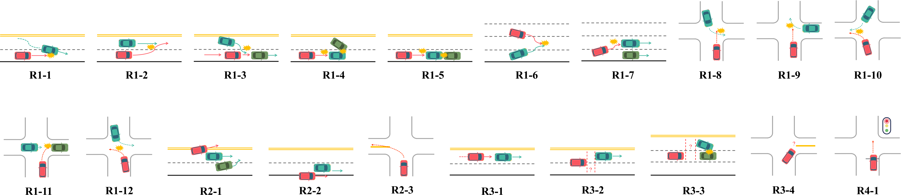
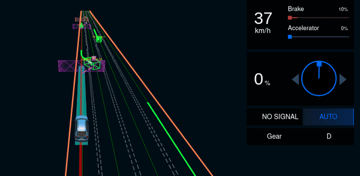
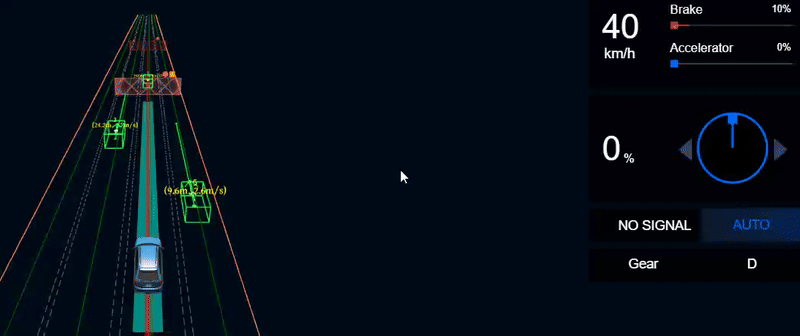
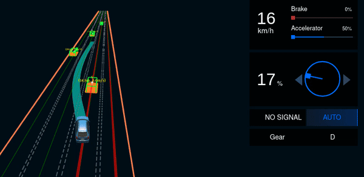
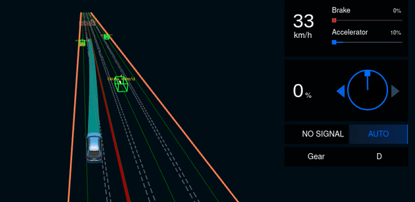
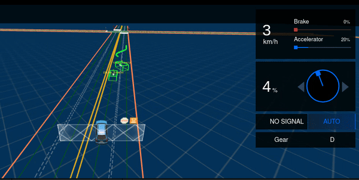
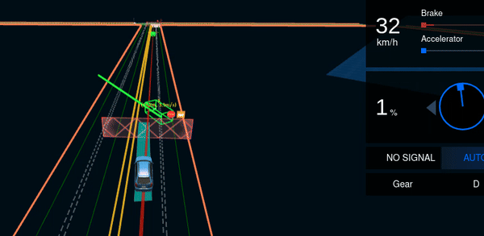
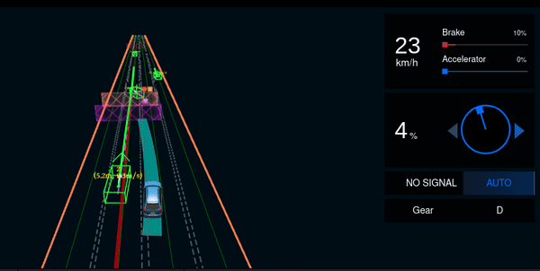
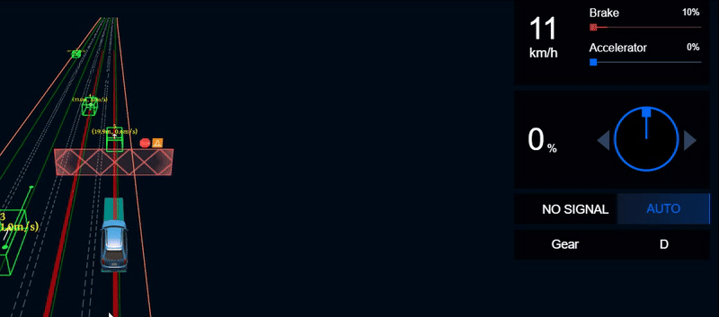

In this work, we propose a novel scenario-based testing framework, DynNPC, to generate more violation scenarios induced by the ADS. Specifically, DynNPC allows NPC vehicles to dynamically generate behaviors using different driving strategies during simulation execution based on traffic signals and the real-time behavior of the Ego vehicle. We compare DynNPC with five state-of-the-art scenario-based testing approaches. Our evaluation has demonstrated the effectiveness and efficiency of DynNPC in finding more violation scenarios induced by the ADS.

The paper will be submitted to ICSE 2025.

## For more details, see the code at [DynNPC GitHub Repository](https://github.com/DynNPC/DynNPC).

---

# Overview

# Maneuver Constraints

According to the data provided by the **National Highway Traffic Safety Administration (NHTSA)**, in real-world driving scenarios, vehicles can perform various maneuvers, including **decelerating, accelerating, passing, parking, backing up, lane changing, turning left, and turning right**. To ensure safety and adherence to traffic regulations, we define constraints for these maneuvers.

We utilize the maneuver specifications provided by CRISCO to constrain the position of maneuver execution and other related aspects.

---

## Lane Changing

### Left Lane Change

When the **NPC vehicle** \(N_k\) performs a **lane-changing maneuver to the left** at frame \(t_0\), it must:

- Maintain a **safe lane-changing distance** from the **following Ego vehicle**.
- **Activate the left turn signal** before executing the lane change.
- **Avoid changing lanes in a solid-line area**.

This maneuver is formally defined as:

\[
\begin{aligned}
    &D_{E2N}(p_{E}^{t_0},p_{N_k}^{t_0}) \geq \text{threshold} \\ 
    &\wedge \ leftSignal(p_{N_k}^{t_0}) = \text{True} \\ 
    &\wedge \ isSolid(p_{N_k}^{t_0}) = \text{False}
\end{aligned}
\]

where:
- \(D_{E2N}(p_{E}^{t_0},p_{N_k}^{t_0})\) returns the **longitudinal distance** between the NPC vehicle and the Ego vehicle.
- \(\text{threshold}\) is set to **30 meters** by default.
- \(leftSignal(p_{N_k}^{t_0})\) indicates if the NPC **left turn signal** is active.
- \(isSolid(p_{N_k}^{t_0})\) checks if **lane markings are solid**.

### Right Lane Change

For a **right lane change**, the NPC vehicle must satisfy the following constraints:

\[
\begin{aligned}
    &D_{E2N}(p_{E}^{t_0},p_{N_k}^{t_0}) \geq \text{threshold} \\ 
    &\wedge \ rightSignal(p_{N_k}^{t_0}) = \text{True} \\ 
    &\wedge \ isSolid(p_{N_k}^{t_0}) = \text{False}
\end{aligned}
\]

where:
- \(rightSignal(p_{N_k}^{t_0})\) checks if the **right turn signal** is active.

---

## Turning

### Left Turn

When an NPC vehicle is **turning left** at an intersection or junction, it must:

- **Slow down before turning** to ensure safety.
- **Ensure no oncoming vehicles** within a predefined safe distance.
- **Use the left turn signal**.
- **Check pedestrian crossings** before executing the maneuver.

\[
\begin{aligned}
    &speed(p_{N_k}^{t_0}) \leq \text{speedLimit}_{turn} \\ 
    &\wedge \ leftSignal(p_{N_k}^{t_0}) = \text{True} \\ 
    &\wedge \ gapOncoming(p_{N_k}^{t_0}) \geq \text{safeGap} \\ 
    &\wedge \ pedestrianClear(p_{N_k}^{t_0}) = \text{True}
\end{aligned}
\]

where:
- \(speed(p_{N_k}^{t_0})\) represents the NPC vehicle’s **speed** at frame \(t_0\).
- \(\text{speedLimit}_{turn}\) is a **turning speed limit** (e.g., **20 km/h**).
- \(gapOncoming(p_{N_k}^{t_0})\) measures the **distance from the nearest oncoming vehicle**.
- \(\text{safeGap}\) is a predefined **safe distance**. (e.g., **10 meters**)
- \(pedestrianClear(p_{N_k}^{t_0})\) ensures **no pedestrians are crossing**.

### Right Turn

Similar constraints apply to a **right turn**, but the vehicle must yield to pedestrians on the right:

\[
\begin{aligned}
    &speed(p_{N_k}^{t_0}) \leq \text{speedLimit}_{turn} \\ 
    &\wedge \ rightSignal(p_{N_k}^{t_0}) = \text{True} \\ 
    &\wedge \ gapOncoming(p_{N_k}^{t_0}) \geq \text{safeGap} \\
    &\wedge \ pedestrianClearRight(p_{N_k}^{t_0}) = \text{True}
\end{aligned}
\]

where:
- \(pedestrianClearRight(p_{N_k}^{t_0})\) ensures **no pedestrians are crossing** from the right side.

---

## Speed-Related Maneuvers

### Decelerating

An NPC vehicle **decelerates** when:
- It approaches a red traffic light or a stop sign.
- A slower vehicle is ahead.
- There is a **speed limit reduction** in the upcoming road section.

\[
\begin{aligned}
    &acceleration(p_{N_k}^{t_0}) \leq \text{decelerationThreshold} \\ 
    &\wedge \ (trafficLight(p_{N_k}^{t_0}) = \text{Red} \vee speedLimitDrop(p_{N_k}^{t_0}) = \text{True})
\end{aligned}
\]

where:
- \(\text{decelerationThreshold}\) is a predefined **deceleration limit**. (e.g., **-5 m/s²**)
- \(acceleration(p_{N_k}^{t_0})\) checks the **negative acceleration** (deceleration).
- \(trafficLight(p_{N_k}^{t_0})\) determines **traffic signal color**.
- \(speedLimitDrop(p_{N_k}^{t_0})\) identifies an upcoming **speed limit reduction**.

### Accelerating

NPC vehicles can **accelerate** under these conditions:
- The traffic light turns **green**.
- A slower vehicle **moves away**.
- The **road speed limit increases**.

\[
\begin{aligned}
    &acceleration(p_{N_k}^{t_0}) \geq \text{accelerationThreshold} \\ 
    &\wedge \ (trafficLight(p_{N_k}^{t_0}) = \text{Green} \vee speedLimitIncrease(p_{N_k}^{t_0}) = \text{True})
\end{aligned}
\]

where:
- \(\text{accelerationThreshold}\) is a predefined **acceleration limit**. (e.g., **5 m/s²**)
- \(speedLimitIncrease(p_{N_k}^{t_0})\) identifies an **upcoming speed limit increase**.

---

## Other Maneuvers

### Passing

NPC vehicles may **pass** slower vehicles under safe conditions:

\[
\begin{aligned}
    &speed(p_{N_k}^{t_0}) > speed(p_{ahead}^{t_0}) \\ 
    &\wedge \ gapLeft(p_{N_k}^{t_0}) \geq \text{safeGap} \\ 
    &\wedge \ leftSignal(p_{N_k}^{t_0}) = \text{True}
\end{aligned}
\]

where:
- \(p_{ahead}^{t_0}\) represents the **vehicle in front**.
- \(gapLeft(p_{N_k}^{t_0})\) checks **safe passing space** on the left.
- \(\text{safeGap}\) is a predefined **safe distance**. (e.g., **5 meters**)

### Parking

An NPC vehicle **parks** when:

\[
\begin{aligned}
    &speed(p_{N_k}^{t_0}) = 0 \\ 
    &\wedge \ isParkingZone(p_{N_k}^{t_0}) = \text{True}
\end{aligned}
\]

where:
- \(isParkingZone(p_{N_k}^{t_0})\) ensures the vehicle is in a **designated parking area**. (e.g., **parking lot**)

---

# Examples of Generated Scenarios

Here are some dynamically generated scenarios using **DynNPC**, showcasing how the **EGO** vehicle interacts with **NPC** vehicles.

## **Overview of Each Ego-induced Violation Pattern**

---

## **Category 1: Ego Vehicle Collides with NPC Vehicles**

### **Case Study R1-1**

When the NPC vehicle attempts to change lanes, the Ego vehicle fails to decelerate in time, leading to a collision. This suggests a potential issue in the prediction module, as the Ego vehicle may not have accurately anticipated the NPC's lane-changing behavior.

### **Case Study R1-2**

When the Ego vehicle changes lanes, it fails to notice the NPC vehicle approaching from behind in the target lane, resulting in a collision. This suggests potential issues in the perception module, as the Ego vehicle may not have correctly detected the NPC vehicle or miscalculated its speed and position.

### **Case Study R1-3**

The Ego vehicle is following an NPC vehicle with a safe distance when another NPC vehicle suddenly cuts in between them from the side. The Ego vehicle fails to anticipate the cut-in and does not take timely action, resulting in a side collision with the cutting-in vehicle. This suggests that the Ego vehicle lacks effective cut-in behavior prediction and risk assessment, leading to delayed responses in dynamic merging scenarios.

### **Case Study R1-4**

Two NPC vehicles collide during a lane change and come to a stop ahead. The Ego vehicle incorrectly perceives the two stationary vehicles as a single object and fails to stop in time, resulting in a collision. This suggests that the Ego vehicle has limitations in object detection and classification, leading to insufficient braking decisions in complex obstacle scenarios.

### **Case Study R1-5**

The Ego vehicle is following an NPC vehicle at high speed, which is also following another NPC vehicle ahead. At a certain moment, the leading vehicle slows down, causing the two NPC vehicles to collide and come to a stop. The sudden stop of the front vehicle leaves the Ego vehicle little time to react. Due to the short distance and high speed, the Ego vehicle fails to stop in time, resulting in a rear-end collision. This suggests that the Ego vehicle may have limitations in predicting the behavior of multiple vehicles in a chain reaction, leading to delayed responses in complex traffic scenarios.

### **Case Study R1-6**

The Ego vehicle and an NPC vehicle attempt to change into the same lane simultaneously from adjacent lanes. Due to a lack of mutual awareness and poor coordination, the Ego vehicle fails to detect the NPC vehicle's movement, resulting in a side collision during the merge. This suggests that the Ego vehicle has limitations in predicting the intentions of nearby vehicles and handling concurrent lane changes.

### **Case Study R1-7**

The Ego vehicle is following a slow-moving NPC vehicle and decides to change lanes to overtake. However, the Ego vehicle fails to notice another NPC vehicle in the adjacent lane ahead and collides with it during the lane change, indicating a problem in the perception module.

### **Case Study R1-8**

The Ego vehicle is going straight through an intersection when an NPC vehicle from the opposite direction makes a left turn. Since the NPC vehicle is moving slowly, the Ego vehicle marks it with a slow vehicle *Ignored* tag and fails to properly predict its turning behavior, resulting in a side collision. This indicates limitations in the prediction module, which fails to accurately anticipate the future trajectory of slow-moving vehicles at intersections.

### **Case Study R1-9**

The Ego vehicle is going straight through an intersection when an NPC vehicle from the opposite direction makes a right turn across its path. Due to the slow speed of the NPC vehicle, the Ego vehicle tags it as *Ignored* and does not yield or decelerate, causing a collision. This indicates a problem in decision-making under interactive traffic situations.

### **Case Study R1-10**

The Ego vehicle is making a left turn at an intersection while an NPC vehicle from the opposite direction is making a right turn. The NPC vehicle is moving slowly, leading the Ego vehicle to assign it an *Ignored* tag and proceed without sufficient caution, resulting in a side collision. This suggests that the Ego vehicle has limitations in handling complex interactions during turning maneuvers when slow-moving vehicles are present.

### **Case Study R1-11**

When the Ego vehicle turns right to merge into traffic, it predicts the speed of the slowly moving vehicle. Consequently, the Ego vehicle collides with the NPC vehicle while turning, indicating a problem in the prediction~module.

### **Case Study R1-12**

The Ego vehicle and an NPC vehicle simultaneously make left turns from opposite directions at an intersection. Due to inaccurate prediction of the NPC vehicle's trajectory, the Ego vehicle fails to yield properly, resulting in a side collision during the turn. This indicates a problem in the prediction module when handling interactive turning behaviors at intersections.
---

## **Category 2: Ego Vehicle Hits Illegal Lines**

### **Case Study R2-1**

When two NPC vehicles occupy the Ego vehicle's lane, the Ego vehicle attempts to avoid them but fails to plan a proper trajectory within the lane boundaries. As a result, the Ego vehicle suddenly crosses the double yellow line, entering the opposite lane, which poses a significant safety risk. This indicates problems in the planning module when handling lane-occupying obstacles.

### **Case Study R2-2**  
  

The Ego vehicle closely follows an NPC vehicle moving ahead at a low speed. As the distance between the two vehicles decreases, the Ego vehicle attempts to overtake by crossing the solid line, violating traffic rules and posing a safety risk. This highlights a flaw in the planning and control modules when handling slow-moving vehicles in constrained scenarios.  

This issue has been reported **Bug 09: Planned Trajectory Goes Off-Road** : The control module relies on the **planning trajectory**, making it crucial to ensure its correctness. However, it has been observed that the trajectory can frequently deviate **off-road**, causing the vehicle to collide with the road curb.  

For further details, refer to the issue discussion in [Apollo Issue #15144](https://github.com/ApolloAuto/apollo/issues/15144).

### **Case Study R2-3**

The Ego vehicle makes a left turn at an intersection but fails to control the turning arc properly, resulting in the vehicle crossing the yellow line and violating traffic regulations. This indicates a problem in the planning and control modules regarding accurate trajectory generation during turning maneuvers.

---

## **Category 3: Ego Vehicle Gets Stuck and Fails to Reach Destination**

### **Case Study R3-1**

The Ego vehicle follows a slow-moving NPC vehicle without performing an overtaking maneuver, despite having sufficient conditions to do so. As a result, the Ego vehicle fails to reach the destination within the required time limit. This indicates a problem in the decision-making module regarding overtaking strategies in low-speed following scenarios.

### **Case Study R3-2**

The Ego vehicle follows an NPC vehicle whose speed fluctuates between normal driving and nearly stopping. Facing this unstable lead vehicle, the Ego vehicle hesitates between continuing to follow and initiating a lane change. As a result, it becomes stuck in decision-making and fails to complete an overtaking maneuver. This reveals limitations in the decision-making module when handling dynamic and uncertain traffic situations.

### **Case Study R3-3**

Two NPC vehicles collide ahead of the Ego vehicle, blocking the lane and forming a static obstacle. The Ego vehicle fails to plan a feasible path to change lanes and bypass the obstacle, resulting in it being stuck behind the blocked lane. This indicates limitations in the planning module when handling unexpected road blockages caused by accidents.

---

## **Category 4: Ego Vehicle Runs Red Lights**

### **Case Study R4-1**

The Ego vehicle stops when the signal is red and passes the stop line. Then, it loses the perception of the traffic signal and restarts to run a red light through the intersection, indicating a bug in the perception module.

Many above issues stem from **Unrealistic Planning** and **Abrupt Changes in Planned Trajectory Points**, as discussed in [Apollo Issue #15144](https://github.com/ApolloAuto/apollo/issues/15144).

**Bug 10: Unrealistic Planning** 
The planned trajectory, particularly the velocity profile, often lacks smoothness, making it difficult for the vehicle to follow accurately. This issue also affects the performance of the control module.

**Bug 11: Abrupt Changes in Planned Trajectory Points**
Abrupt changes in the planned trajectory occur because the trajectory output continuously updates based on the current vehicle state but lacks proper smoothing before being fed into the control module. This instability affects the vehicle's ability to follow the planned path accurately and can lead to control issues, particularly in heading angle, velocity, and acceleration adjustments.

**Note:** To replicate specific experimental scenarios in this documentation, refer to the data stored in the `/records` folder.
